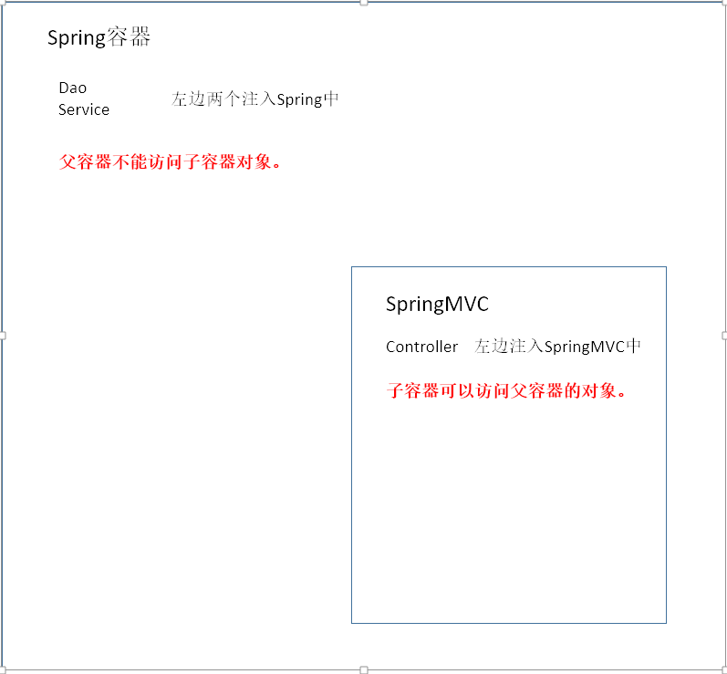

## 一．关于SSH包扫描冲突的问题

### 一.Spring和SpringMVC的父子容器的关系。

### 在SSH中，配置spring和springmvc的包扫描（IOC）Spring在初始化加载application文件，会创建一个容器。

### 然后是SpringMVC的DispatchServlet前段控制器，当DispatchServlet初始化之后，会在Spring中又创建一个新的容器。

## 1.父容器可不可以访问子容器，子容器可不可以访问父容器？

 如上图在Service中注入Dao（初始化自动注入，利用@Autowired），接着在Controller里注入Service（初始化自动注入，利用@Autowired），这就意味这作为SpringMVC的子容器是可以访问父容器Spring对象的。

要是反过来呢，你把Controller注入到Service中,可想而知，必然是不行的。

 

## 2. 为什么springMVC我们最好配置扫描Controller层呢？

如果我们扫描了service层，因为DispatchServlet只会扫描当前容器，无法获取spring中对象的配置，而我们的事物是事先配置在service层配置在spring层的，service层需要的是一个动态代理对象。而springMVC初始化时，会优先在自己的容器中创建对象，访问不到spring中关于事物的配置，会重新创建一个service对象，是一个普通对象，会导致事物的失效。

 

 

## 解决办法：

### 1.分开扫描

### 2. <context:include-filter/>    <context:exclude-fliter>

## 1. Spring加载全部bean,MVC加载Controller运行之后

测试结果：TestService通过，界面显示正常。

 原因：父容器加载了全部bean,所以Controller能访问到Service。MVC容器默认查找当前容器，能查到有转发的Controller规则所以界面正常跳转。

## 2.Spring加载全部Bean,MVC容器啥也不加载

 测试结果：TestService通过，界面显示404。

  原因：父容器加载了全部bean,所以Controller 能访问到Service。MVC容器默认查找当前容器的Controller，找不到所以界面出现404。

## 3. Spring不加载bean，MVC加载所有的bean

测试结果：TestService通过，界面正常。

 原因：因为所有的bean都在子容器中，也能查到当前容器中的Controller,所以没啥问题。
