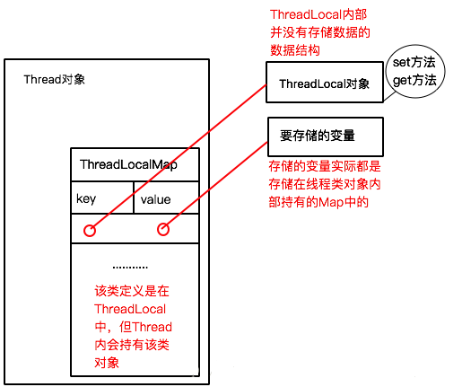

# 					浅谈ThreadLocal

## ThreadLocal：Thread 的局部变量

​	ThreadLocal 从字面意思上看，本地线程。 许多人会有这样的误解，其实ThreadLocal并不是一个Thread。它只是作为Thread的局部变量。下图是Thread和ThreadLocal的关系。




​	图中能更好的帮助我们理解Thread和ThreadLocal之间的关系

```
	线程内部有一个ThreadLocalMap存放着自己的局部变量，其中key存放着我们的ThreadLocal对象，value存放着我们的变量，所以，当每有一个变量想要放入线程的局部变量之中，就需要创建一个ThreadLocal对象。ThreadLocal并没有存储结构，它只是作为一个搬运工，提供了一个方法而已。

	它并不是为了自带了线程安全，并发控制这些机制，它是通过牺牲空间（创建额外更多的对象来），为了让线程使用自己的变量。—让同一个线程上的所有代码块都是使用的该变量。

	就比如我们的对数据库操作，我们一定是需要定义数据库连接的，如果让我们所有的线程去共享我们的连接，又是线程不安全的，会导致事物发生混乱，那么我们就需要让我们的线程同步，但是同步就很消耗性能，实现不了性能的优化，此时我们的ThreadLocal很好的解决了这个问题。这样我们确保了每一个线程使用一个Collection，ThreadLocal为每一个线程创建了一个对象，放在了一个空间中。这样我们就不需要同步代码了，也解决了线程安全问题。

```


## 源码：

就两个重要方法：

### set方法

```
    public void set(T value) {
        //获取当前线程，然后获取到当前线程里面的ThreadLocalMap引用，
        //判断当前线程里面是创建该Map对象，有则直接set，没有就初始化一个Map,再将值放入。
        Thread t = Thread.currentThread();
        ThreadLocalMap map = getMap(t);
        if (map != null)
            map.set(this, value);// 以ThreadLocal对象为key 传入value为value
        else
            createMap(t, value);
    }12345678910
```

### get方法

```
  public T get() {

        Thread t = Thread.currentThread();

        ThreadLocalMap map = getMap(t);

        //存在Map就找到当前线程Map中该ThreadLocal对象的value

        if (map != null) {

            ThreadLocalMap.Entry e = map.getEntry(this);

            if (e != null) {

                @SuppressWarnings("unchecked")

                T result = (T)e.value;

                return result;

            }

        }

        //没有就初始化它

        return setInitialValue();

    }

```

  